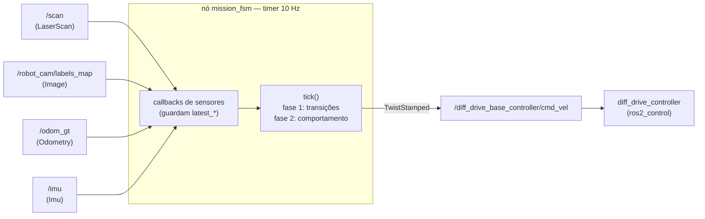
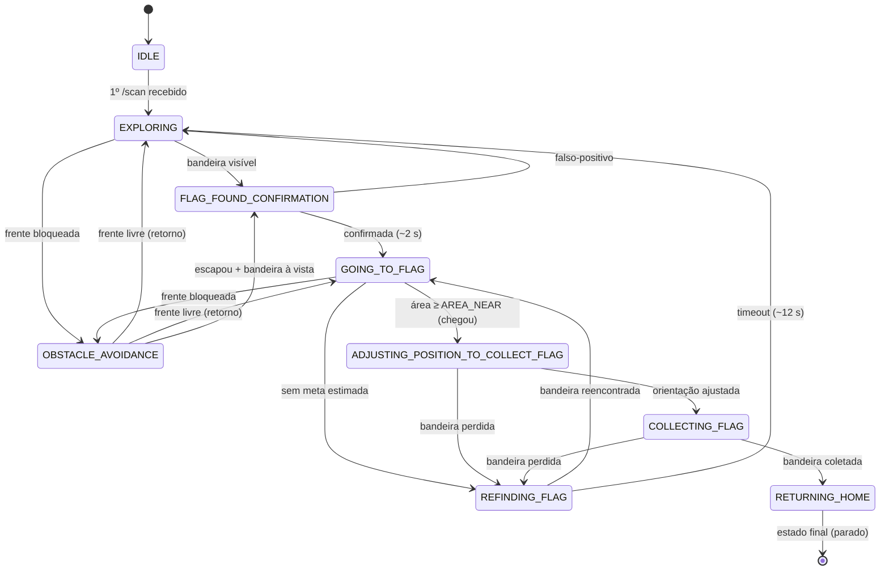

# Capture the Flag — Robô Autônomo de Exploração e Captura

**SSC0712 — Programação de Robôs Móveis · USP São Carlos (ICMC)**
**Trabalho 1 — Sistema de Exploração, Navegação e Controle da Missão com ROS 2**

Robô diferencial autônomo que **explora uma arena, detecta uma bandeira por visão
computacional (câmera de segmentação semântica) e se posiciona para capturá-la**, com
controle baseado em **máquina de estados (FSM)** e desvio de obstáculos por LIDAR.

Link para os slides: https://docs.google.com/presentation/u/0/d/1Btu7tvaXl8BQucPhcyZa-rEQ95vv61s9dBTqny8FILs/mobilepresent

> Pacote renomeado de `prm_2026` para **`capture_the_flag`** (requisito do trabalho).

---

## 1. Stack

- **ROS 2 Jazzy**
- **Gazebo (gz sim, Harmonic)** — mundo padrão: `world/arena_cilindros.sdf`
- **Python / `rclpy`**
- **`ros2_control`** (`diff_drive_controller`)
- **OpenCV + `cv_bridge`**, **NumPy** — processamento da câmera de segmentação
- **RViz2** — visualização

---

## 2. Compilação

Na **raiz do workspace** (ex.: `~/ros2_ws`, com este pacote em `src/`):

```bash
# 1. Dependências (primeira vez)
rosdep install --from-paths src --ignore-src -r -y

# 2. Compilar
colcon build --symlink-install --packages-select capture_the_flag

# 3. Atualizar o ambiente do terminal
source install/local_setup.bash
```

> O repositório também inclui `Dockerfile` + `docker-compose.yml` (imagem ROS 2 Jazzy).
> Para usar: `docker compose up -d` e então `docker exec -it jazzy_robos bash`.

---

## 3. Execução

São **três terminais** (lembre de `source install/local_setup.bash` em cada um):

```bash
# Terminal 1 — inicia o Gazebo com a arena (mundo padrão: arena_cilindros.sdf)
ros2 launch capture_the_flag inicia_simulacao.launch.py
#   (mundo alternativo:  ros2 launch capture_the_flag inicia_simulacao.launch.py world:=arena.sdf)

# Terminal 2 — carrega o robô, sensores, controladores, odometria e RViz
ros2 launch capture_the_flag carrega_robo.launch.py

# Terminal 3 — inicia a missão autônoma (a máquina de estados)
ros2 run capture_the_flag mission_fsm
```

O robô nasce em `(-8.0, -0.5)` virado para `+x`. A bandeira-alvo (`blue_flag`) fica em
`(8.0, 0.0)` — cerca de 16 m à frente, ao longo de `+x`. (A `red_flag` fica em `(-8.0, 0.0)`,
ao lado do ponto de nascimento, e **não** é o alvo.)
Acompanhe o progresso pelos logs do `mission_fsm` (estado atual, distância, área do blob).
A missão termina com o log **`BANDEIRA COLETADA! Missao cumprida.`** e o robô parado
junto à bandeira.

---

## 4. Arquitetura

**Fluxo de dados.** Os callbacks dos sensores apenas guardam o último dado (`latest_*`);
toda a decisão acontece no `tick()` (timer 10 Hz), que publica um único `TwistStamped`.



### 4.1 Modelagem do robô e sensores (`description/robot.urdf.xacro`)

- **Base diferencial** (`diff_drive_controller` via `gz_ros2_control`) + **braço/garra**
  frontal (estende ~0.4 m à frente do `base_link` — relevante para o desvio).
- **Câmera de segmentação semântica** (`/robot_cam/labels_map`, 320×240, hfov 1.57 rad).
- **LIDAR 2D** (`gpu_lidar`, 360°, alcance 0.12–3.5 m, índice 0 = frente).
- **IMU**.
- TFs publicados por `robot_state_publisher`. A pose é fornecida pelo nó
  `ground_truth_odometry` no tópico **`/odom_gt`** (`nav_msgs/Odometry`, sem drift).

### 4.2 Máquina de estados — `capture_the_flag/mission_fsm.py` (núcleo do trabalho)

FSM dirigida por **timer (~10 Hz)** com **tick em duas fases**: (1) checa as transições do
estado atual; (2) executa o comportamento do estado. Comportamentos e transições ficam em
**dicionários de callables**; callbacks de sensores apenas guardam o último dado (`latest_*`).

**9 estados:**

| Estado | Comportamento |
|---|---|
| `IDLE` | parado; espera o 1º `/scan` |
| `EXPLORING` | anda para frente procurando a bandeira |
| `OBSTACLE_AVOIDANCE` | desvio com prioridade (subsumption) — ver 4.4 |
| `FLAG_FOUND_CONFIRMATION` | para e observa ~2 s para filtrar falso-positivo |
| `GOING_TO_FLAG` | navega até a **meta lembrada** da bandeira (ver 4.3) |
| `REFINDING_FLAG` | gira procurando a bandeira perdida (fallback) |
| `ADJUSTING_POSITION_TO_COLLECT_FLAG` | gira no lugar para centralizar a bandeira |
| `COLLECTING_FLAG` | coleta simbólica: parado ~5 s + log de sucesso |
| `RETURNING_HOME` | **estado final**: missão concluída, robô parado |

**Fluxo nominal:** `IDLE → EXPLORING → FLAG_FOUND_CONFIRMATION → GOING_TO_FLAG →
ADJUSTING_POSITION → COLLECTING_FLAG → RETURNING_HOME (parado)`.

**Grafo completo** (descrições por estado em [`fsm-diagram.md`](fsm-diagram.md)):



### 4.3 Percepção e meta no frame odom

- **Detecção:** máscara do `labels_map` onde `label == 25` (`blue_flag`), maior contorno,
  centroide + área. `AREA_MIN` descarta blobs minúsculos (ruído/longe).
- **Memória da meta:** ao ver a bandeira, projeta-se o *bearing* (pela hfov) para um
  **ponto no frame odom** (`flag_goal`). Assim, perder o pixel (ex.: durante um desvio)
  **não faz o robô parar** — ele segue para o ponto lembrado; a câmera só refina a meta.
- **Chegada (arrival):** **visual** — `latest_flag_area ≥ AREA_NEAR`. A bandeira pode não
  estar no plano do LIDAR, então a **área do blob** é o sinal de proximidade confiável.

### 4.4 Navegação e desvio de obstáculos

- **Controlador go-to-point (uniciclo):** gira para a meta (erro de *bearing*) e avança
  proporcional à distância, freando quando desalinhado.
- **`OBSTACLE_AVOIDANCE` (override por subsumption):** acionado de qualquer estado que ande
  para frente quando o LIDAR vê obstáculo dentro de `FRONT_BLOCK_DIST`; ao liberar, retorna
  ao estado anterior (registro `previous_state`). Maneuver em **três fases**:
  1. **BACKUP** — se está perto demais para girar (o braço de 0.4 m varreria o obstáculo),
     dá ré para abrir espaço;
  2. **TURN** — gira para o **lado da bandeira** (`_choose_turn_dir`, com fallback para o
     setor mais livre), com compromisso mínimo e **histerese** (anti-chatter);
  3. **ESCAPE** — anda em **arco** contornando o obstáculo (wall-following emergente).
  Inclui **escape anti-livelock** (relaxa o critério de saída se girar demais, evitando
  ficar preso girando para sempre).
- **Repulsão lateral (campo potencial, em `GOING_TO_FLAG`):** o arco frontal (±25°) não
  enxerga cilindros que passam rente ao **flanco/roda**. Como camada reativa *sem trocar de
  estado*, `_side_repulsion()` varre 25°→110° de cada lado e empurra o comando para **longe
  do lado mais próximo** + freia, proporcional à proximidade. O limiar de folga **diminui
  com o ângulo** (`SIDE_CLEAR_FRONT`→`SIDE_CLEAR_SIDE`), aproximando o *footprint inflado*
  do robô (mais espaço à frente, onde se translada; menos no flanco, onde o corpo já ocupa
  a folga). Como a meta `flag_goal` é lembrada no frame odom, desviar de raspão não faz
  perder a bandeira.

### 4.5 Estrutura do pacote

```
capture_the_flag/
├── capture_the_flag/        # nós Python
│   ├── mission_fsm.py        #  ← máquina de estados da missão (núcleo)
│   ├── ground_truth_odometry.py
│   └── robo_mapper.py
├── description/              # URDF/Xacro do robô + sensores
├── launch/                  # inicia_simulacao / carrega_robo
├── world/                   # arenas .sdf (padrão: arena_cilindros.sdf)
├── models/                  # modelos do Gazebo (obstáculos, paredes, arena)
├── config/                  # controller_config.yaml (diff-drive)
└── rviz/                    # configuração do RViz
```

---

## 5. Tópicos principais (nó `mission_fsm`)

| Direção | Tópico | Tipo |
|---|---|---|
| publica | `/diff_drive_base_controller/cmd_vel` | `geometry_msgs/TwistStamped` |
| assina | `/scan` | `sensor_msgs/LaserScan` |
| assina | `/odom_gt` | `nav_msgs/Odometry` |
| assina | `/robot_cam/labels_map` | `sensor_msgs/Image` |
| assina | `/imu` | `sensor_msgs/Imu` |

---

## 6. Parâmetros de ajuste (constantes no topo de `mission_fsm.py`)

| Parâmetro | Função |
|---|---|
| `FRONT_BLOCK_DIST` / `DANGER_DIST` | distância de bloqueio / perigo no arco frontal |
| `AREA_MIN` / `AREA_NEAR` | área mín. para detectar / área para "chegou" na bandeira |
| `CONFIRM_TICKS` / `COLLECT_TICKS` | duração da confirmação / da coleta (em ticks de 10 Hz) |
| `GOAL_KP_ANG` / `GOAL_KP_LIN` / `GOAL_V_MAX` | ganhos e limite do go-to-point |
| `ESCAPE_FWD` / `ESCAPE_CURVE` | velocidade e curvatura do arco de contorno (raio = FWD/CURVE) |
| `ROTATE_SAFE_DIST` / `AVOID_BACK` | folga p/ girar com segurança / velocidade de ré |
| `SIDE_CLEAR_FRONT` / `SIDE_CLEAR_SIDE` | folga lateral exigida na frente (25°) / no flanco (110°) — *footprint* inflado |
| `SIDE_KP_ANG` / `SIDE_BRAKE` | ganho do empurrão angular / freio linear da repulsão lateral |

---

## 7. Limitações conhecidas

- **Desvio reativo** (sem planejador global): a maneuver de contorno é eficaz em cilindros
  isolados; uma bandeira encravada num canto de parede pode exigir um planejador (ex.: A*
  sobre o mapa do `robo_mapper`).
- **Odometria ground-truth** (`/odom_gt`): exata na simulação; num robô real entraria
  fusão (EKF) de rodas + IMU, com possível drift.
- **Coleta e retorno simbólicos**: sem garra; o retorno à base é opcional (Trabalho 2) e
  aqui o robô apenas para junto à bandeira ao concluir.
</content>
