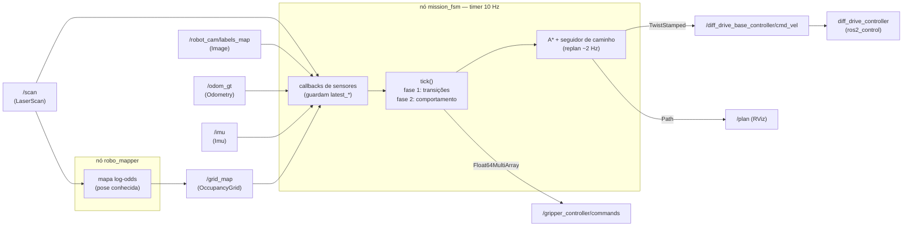
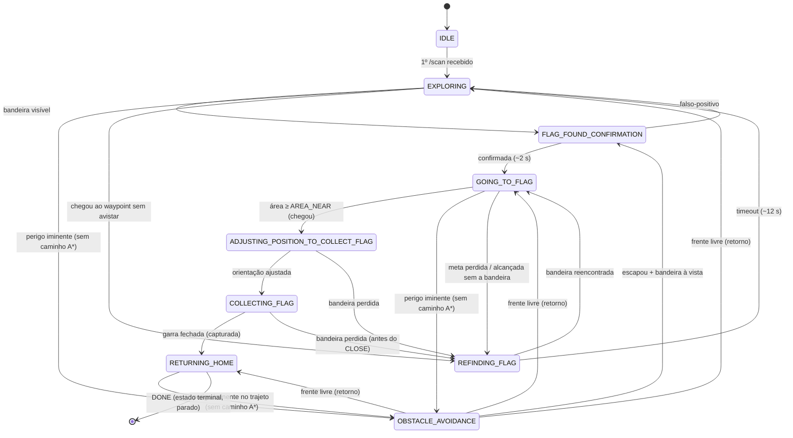

# Capture the Flag — Robô Autônomo de Localização, Captura, Retorno e Depósito

**SSC0712 — Programação de Robôs Móveis · USP São Carlos (ICMC)**
**Trabalho 2 — Localizar, Capturar, Retornar e Depositar a bandeira azul**

Robô diferencial autônomo que **localiza a bandeira azul por visão (câmera de segmentação
semântica), captura-a com a garra real, retorna à base e a deposita**. A missão é dirigida por
uma **máquina de estados (FSM)**, com **navegação global por A\*** sobre um **mapa de ocupação**
construído em tempo real pelo LIDAR (`robo_mapper`) e uma **rede reativa de segurança** subordinada
ao planejador.

Link para os slides: https://docs.google.com/presentation/u/0/d/1Btu7tvaXl8BQucPhcyZa-rEQ95vv61s9dBTqny8FILs/mobilepresent

> Pacote renomeado de `prm_2026` para **`capture_the_flag`** (requisito do trabalho).

---

## 1. Stack

- **ROS 2 Jazzy**
- **Gazebo (gz sim, Harmonic)** — mundo padrão: `world/arena_cilindros.sdf`
- **Python / `rclpy`**
- **`ros2_control`** (`diff_drive_controller` + `gripper_controller`)
- **OpenCV + `cv_bridge`**, **NumPy**, **SciPy** (`ndimage` — inflação, distância de clearance)
- **RViz2** — visualização (mapa de ocupação `/grid_map`, caminho `/plan`)

---

## 2. Compilação

Na **raiz do workspace** (ex.: `~/ros2_ws`, com este pacote em `src/`):

```bash
# 1. Dependências (primeira vez)
rosdep install --from-paths src --ignore-src -r -y

# 2. Compilar
colcon build --symlink-install --packages-select capture_the_flag

# 3. Atualizar o ambiente do terminal
source install/local_setup.bash
```

> O repositório também inclui `Dockerfile` + `docker-compose.yml` (imagem ROS 2 Jazzy).
> Para usar: `docker compose up -d` e então `docker exec -it jazzy_robos bash`.

---

## 3. Execução

São **três terminais** (lembre de `source install/local_setup.bash` em cada um):

```bash
# Terminal 1 — inicia o Gazebo com a arena (mundo padrão: arena_cilindros.sdf)
ros2 launch capture_the_flag inicia_simulacao.launch.py
#   (mundo alternativo:  ros2 launch capture_the_flag inicia_simulacao.launch.py world:=arena_paredes.sdf)

# Terminal 2 — carrega o robô, sensores, controladores, odometria, o mapeador e RViz
ros2 launch capture_the_flag carrega_robo.launch.py

# Terminal 3 — inicia a missão autônoma (a máquina de estados)
ros2 run capture_the_flag mission_fsm
```

O robô nasce em ≈ `(-8.0, -0.5)` (zona vermelha), virado para `+x`. A bandeira-alvo
(`blue_flag`, label `25`) fica na **zona azul** (`+x`) — `x ≈ 6` no `empty_arena` e `x ≈ 8`
no `arena_cilindros`/`arena_paredes`. A "casa" do retorno **não** é `(0,0)`: é a **pose de
spawn registrada** na 1ª mensagem de `/odom_gt` (`self.start_pose`).

**Mapas avaliados (3):**

| Mundo | Obstáculos | Observação |
|---|---|---|
| `empty_arena.sdf` | nenhum (arena aberta) | sem zona de depósito (`label 28`) → depósito por **odometria** (volta à pose de spawn) |
| `arena_cilindros.sdf` | cilindros isolados | A\* roteia pelos vãos; repulsão lateral cobre o flanco |
| `arena_paredes.sdf` | "U" com porta central | exige movimento **não-guloso** (contornar a parede-fundo pelos vãos laterais) — o caso que motivou o A\* |

Acompanhe o progresso pelos logs do `mission_fsm` (estado atual, distância, área do blob,
sub-fases da captura/retorno). A missão encerra com o log
**`MISSÃO CONCLUÍDA — garra fechada, robô parado.`** (estado terminal `RETURNING_HOME/DONE`).

---

## 4. Arquitetura

**Fluxo de dados.** Os callbacks dos sensores apenas guardam o último dado (`latest_*`,
`occ_grid`, `pose`); toda a decisão acontece no `tick()` (timer 10 Hz), que publica um único
`TwistStamped` (velocidade) e comanda a garra. Em paralelo, o `mission_fsm` replaneja o caminho
A\* (~2 Hz) contra o `/grid_map` publicado pelo nó `robo_mapper`.



### 4.1 Modelagem do robô e sensores (`description/`)

- **Base diferencial** (`diff_drive_controller` via `gz_ros2_control`) + **braço/garra**
  frontal que estende ~0.4 m à frente do `base_link` (relevante para folga e desvio).
- **Garra** (`gripper_controller`, `/gripper_controller/commands`,
  `Float64MultiArray = [elevação, braço DIR, braço ESQ]` em **metros**; o controlador **segura**
  a última pose). Poses calibradas: `OPEN [0.0,-0.06,0.06]`, `CLOSED [0.0,0.0,0.0]`,
  `LIFTED [-0.5,0.0,0.0]`. A garra é fechada **simetricamente** (`dir == -esq`).
- **Câmera de segmentação semântica** (`/robot_cam/labels_map`, hfov 1.57 rad).
- **LIDAR 2D** (360°, alcance 0.12–3.5 m, índice 0 = frente). Em `ext=0` a garra fica logo
  **abaixo** do plano do LIDAR (z≈0.12) → `/scan` lê o mastro limpo; só LEVANTAR o braço cruza
  o plano (filtrado no mapeador).
- **IMU** (modelada e assinada; o FSM usa o yaw do `/odom_gt`).
- A pose é fornecida pelo nó `ground_truth_odometry` no tópico **`/odom_gt`**
  (`nav_msgs/Odometry`, *ground truth*, sem drift) — é a **única** fonte de pose.

### 4.2 Máquina de estados — `capture_the_flag/mission_fsm.py` (núcleo do trabalho)

FSM dirigida por **timer (~10 Hz)** com **tick em duas fases**: (1) checa as transições do
estado atual; (2) executa o comportamento do estado. Comportamentos e transições ficam em
**dicionários de callables**; callbacks de sensores apenas guardam o último dado.

**9 estados:**

| Estado | Comportamento |
|---|---|
| `IDLE` | parado; espera o 1º `/scan` |
| `EXPLORING` | **busca dirigida**: segue o caminho A\* até um waypoint na zona azul |
| `OBSTACLE_AVOIDANCE` | rede reativa de segurança (subsumption) **subordinada ao A\*** — ver 4.4 |
| `FLAG_FOUND_CONFIRMATION` | para e observa ~2 s para filtrar falso-positivo |
| `GOING_TO_FLAG` | segue o caminho A\* até a **meta lembrada** da bandeira (ver 4.3) |
| `REFINDING_FLAG` | gira procurando a bandeira perdida (fallback) |
| `ADJUSTING_POSITION_TO_COLLECT_FLAG` | gira no lugar para centralizar a bandeira |
| `COLLECTING_FLAG` | **captura real com a garra**: `OPEN → CREEP → CLOSE` |
| `RETURNING_HOME` | retorna à base e deposita: `LIFT → NAVIGATE → DEPOSIT → REVERSING → CLOSING → DONE` |

**Fluxo nominal:** `IDLE → EXPLORING → FLAG_FOUND_CONFIRMATION → GOING_TO_FLAG →
ADJUSTING_POSITION → COLLECTING_FLAG → RETURNING_HOME`, terminando em `RETURNING_HOME/DONE`
(parado, garra fechada).

**Captura real (`COLLECTING_FLAG`, sub-fases):**
- `OPEN` — parado, abre as pinças.
- `CREEP` — avança devagar (`CREEP_FWD`), **centrando no MASTRO pelo LIDAR** (não no centroide
  da câmera, que inclui o painel deslocado); para quando o mastro chega a `GRASP_DIST`.
- `CLOSE` — parado, fecha as pinças e deixa o aperto assentar.

**Retorno e depósito (`RETURNING_HOME`, sub-fases):**
- `LIFT` — levanta o braço (mastro acima do LIDAR).
- `NAVIGATE` — navega de volta à **pose de spawn** (`start_pose`) pelo A\*.
- `DEPOSIT` — abaixa o braço e abre a garra; espera assentar (solta a bandeira na base).
- `REVERSING` — dá ré ~0.5 m para afastar a garra da bandeira depositada.
- `CLOSING` — fecha a garra.
- `DONE` — **estado terminal** (parado; sem re-exploração).

**Grafo** (descrições por estado em [`fsm-diagram.md`](fsm-diagram.md)):



### 4.3 Percepção e meta no frame odom

- **Detecção:** máscara do `labels_map` onde `label == 25` (`blue_flag`), maior contorno,
  centroide + área. `AREA_MIN` descarta blobs minúsculos (ruído/longe).
- **Memória da meta:** ao ver a bandeira, projeta-se o *bearing* (pela hfov) para um
  **ponto no frame odom** (`flag_goal`). Assim, perder o pixel (ex.: durante um desvio)
  **não faz o robô parar** — ele segue para o ponto lembrado; a câmera só refina a meta.
- **Chegada (arrival):** **visual** — `latest_flag_area ≥ AREA_NEAR`. A bandeira pode não
  estar no plano do LIDAR, então a **área do blob** é o sinal de proximidade confiável.

### 4.4 Mapeamento, planejamento global (A\*) e navegação

**Mapa de ocupação — `capture_the_flag/robo_mapper.py`.** Como `/odom_gt` é pose *ground truth*
sem deriva, isto é **mapeamento com pose conhecida** (não é SLAM): cada feixe do LIDAR é
carimbado na grade por **log-odds** (raio livre + célula final ocupada). Grade `190×90 @ 0.1 m`
cobrindo a arena (18×8 m), publicada em **`/grid_map`** com TF estático `map → odom_gt`. Ao
**carregar** a bandeira (braço levantado), retornos próximos e dentro do cone frontal são
filtrados (o mastro balançando não vira obstáculo fantasma).

**Planejador A\* (no `mission_fsm`).** A cada `REPLAN_PERIOD` (~0.5 s):
1. **Inflação** dos obstáculos pelo raio do corpo (`INFLATION_M`); o **desconhecido conta como
   livre** (otimismo → o robô avança e descobre). A arena externa é confinada a priori.
2. **Custo suave de clearance:** células próximas de obstáculo recebem **penalidade** (não
   bloqueio) proporcional à distância à borda inflada → o caminho prefere o **miolo** do
   corredor / a rota de maior folga, **sem fechar** os vãos estreitos.
3. **A\* 8-conexo** (heurística euclidiana) → caminho simplificado aos **cantos**, publicado em
   `/plan` (RViz).

**Seguidor de caminho (carrot / pure-pursuit).** Em vez de mirar reto na meta final (que pode
estar atrás de uma parede), o seguidor mira num **carrot** a `LOOKAHEAD_DIST` à frente sobre o
caminho. Como o replanejamento parte sempre da pose atual, o caminho começa junto ao robô.
*(Lookahead pequeno mantém a proa colada ao centro do corredor — essencial nos vãos apertados
do `arena_paredes`.)*

**Rede reativa de segurança (subordinada ao A\*).**
- **`OBSTACLE_AVOIDANCE`** (3 fases `BACKUP → TURN → ESCAPE`, com histerese anti-chatter e
  escape anti-livelock) só dispara no **fallback sem caminho A\*** ou em perigo iminente; com um
  caminho válido o A\* já roteia pelas portas.
- **Repulsão lateral** (`_side_repulsion`, projeção **cartesiana** de cada feixe): o arco frontal
  (±25°) não vê obstáculos rente ao flanco/roda. Como camada reativa *sem trocar de estado*, ela
  **freia** perto de parede sempre; o empurrão **angular** atua só no fallback sem caminho (com
  caminho, a direção já vem do A\*, evitando cancelar curvas em cantos convexos).

### 4.5 Estrutura do pacote

```
capture_the_flag/
├── capture_the_flag/         # nós Python
│   ├── mission_fsm.py        #  ← máquina de estados + A* + seguidor de caminho (núcleo)
│   ├── robo_mapper.py        #  ← mapa de ocupação log-odds (/grid_map)
│   └── ground_truth_odometry.py
├── description/              # URDF/Xacro do robô + sensores + garra
├── launch/                  # inicia_simulacao / carrega_robo
├── world/                   # arenas .sdf (padrão: arena_cilindros.sdf)
├── models/                  # modelos do Gazebo (obstáculos, paredes, arena)
├── config/                  # controller_config.yaml (diff-drive + garra)
└── rviz/                    # configuração do RViz
```

---

## 5. Tópicos principais

**Nó `mission_fsm`:**

| Direção | Tópico | Tipo |
|---|---|---|
| publica | `/diff_drive_base_controller/cmd_vel` | `geometry_msgs/TwistStamped` |
| publica | `/gripper_controller/commands` | `std_msgs/Float64MultiArray` |
| publica | `/plan` | `nav_msgs/Path` |
| assina | `/scan` | `sensor_msgs/LaserScan` |
| assina | `/odom_gt` | `nav_msgs/Odometry` |
| assina | `/robot_cam/labels_map` | `sensor_msgs/Image` |
| assina | `/imu` | `sensor_msgs/Imu` |
| assina | `/grid_map` | `nav_msgs/OccupancyGrid` |

**Nó `robo_mapper`:**

| Direção | Tópico | Tipo |
|---|---|---|
| publica | `/grid_map` | `nav_msgs/OccupancyGrid` |
| publica | TF | `map → odom_gt` (estático) |
| assina | `/scan` | `sensor_msgs/LaserScan` |
| assina | `/model/prm_robot/pose` | `geometry_msgs/Pose` |
| assina | `/gripper_controller/commands` | `std_msgs/Float64MultiArray` |

---

## 6. Parâmetros de ajuste (constantes no topo de `mission_fsm.py`)

| Parâmetro | Função |
|---|---|
| `FRONT_BLOCK_DIST` / `DANGER_DIST` | distância de bloqueio / perigo no arco frontal |
| `AREA_MIN` / `AREA_NEAR` | área mín. para detectar / área para "chegou" na bandeira |
| `CONFIRM_TICKS` | duração da confirmação da bandeira (ticks de 10 Hz) |
| `GRIPPER_OPEN` / `GRIPPER_CLOSED` / `GRIPPER_LIFTED` | poses da garra (m) |
| `CREEP_FWD` / `GRASP_DIST` / `CREEP_KP_ANG` | avanço/parada/centragem na captura (CREEP) |
| `INFLATION_M` | raio de inflação dos obstáculos no A\* |
| `CLEARANCE_PREF_M` / `CLEARANCE_W` | folga preferida / peso do custo suave de clearance |
| `LOOKAHEAD_DIST` / `WAYPOINT_REACHED` / `REPLAN_PERIOD` | seguidor (carrot) e cadência do replan |
| `GOAL_KP_ANG` / `GOAL_KP_LIN` / `GOAL_V_MAX` | ganhos e limite do go-to-point |
| `CARRY_V_MAX` / `CARRY_W_MAX` / `CARRY_BODY_EXTRA` | limites e folga extra ao carregar a bandeira |
| `LAT_CLEAR` / `SIDE_KP_ANG` / `SIDE_BRAKE` | folga lateral / empurrão angular / freio da repulsão |
| `REVERSE_DIST` / `LIFT_TICKS` / `DEPOSIT_TICKS` | sub-fases do retorno/depósito |

> Mapeador (`robo_mapper.py`): `RESOLUTION 0.1 m`, grade `190×90`, `L_FREE`/`L_OCC` (log-odds),
> `OCC_THRESH`/`FREE_THRESH` (limiares ocupado/livre).

---

## 7. Limitações conhecidas

- **Confirmação de captura sem sensor de contato:** o sucesso é inferido por o mastro continuar
  visível após o fecho — sinal fraco (registrado no log para inspeção).
- **Odometria *ground-truth*** (`/odom_gt`): exata na simulação; num robô real entraria fusão
  (EKF) de rodas + IMU, com possível drift, e o mapeamento viraria SLAM de fato.
- **Mapeamento com pose conhecida:** depende do `/odom_gt`; sem pose confiável, o A\* perderia a
  referência do mapa.
</content>
