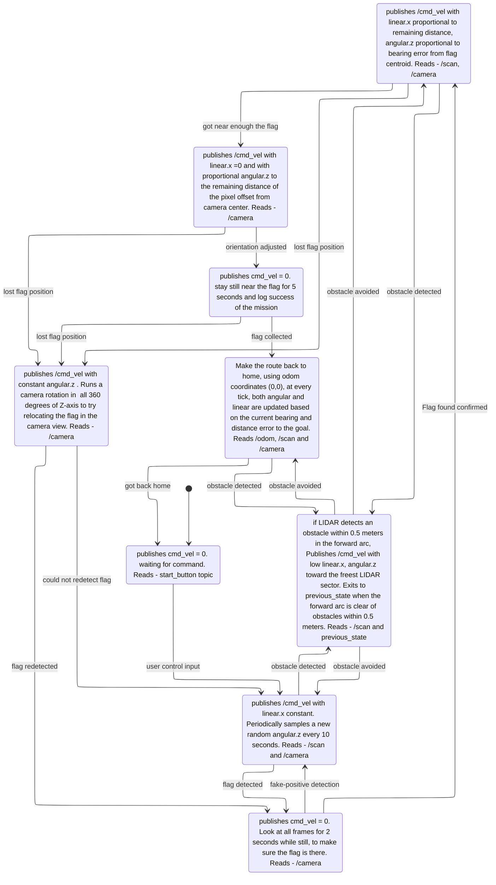

```mermaid
---
config:
    layout: elk
---
stateDiagram-v2

    IDLE : publishes cmd_vel = 0. waiting for command. Reads - start_button topic
    
    EXPLORING : publishes /cmd_vel with linear.x constant. Periodically samples a new random angular.z every 10 seconds. Reads - /scan and /camera

    OBSTACLE_AVOIDANCE : if LIDAR detects an obstacle within 0.5 meters in the forward arc, Publishes /cmd_vel with low linear.x, angular.z toward the freest LIDAR sector. Exits to previous_state when the forward arc is clear of obstacles within 0.5 meters. Reads - /scan and previous_state
    
    FLAG_FOUND_CONFIRMATION : publishes cmd_vel = 0. Look at all frames for 2 seconds while still, to make sure the flag is there. Reads - /camera

    GOING_TO_FLAG : publishes /cmd_vel with linear.x proportional to remaining distance, angular.z proportional to bearing error from flag centroid. Reads - /scan, /camera

    REFINDING_FLAG : publishes /cmd_vel with constant angular.z . Runs a camera rotation in  all 360 degrees of Z-axis to try relocating the flag in the camera view. Reads - /camera

    ADJUSTING_POSITION_TO_COLLECT_FLAG : publishes /cmd_vel with linear.x =0 and with proportional angular.z to the remaining distance of the pixel offset from camera center. Reads - /camera

    COLLECTING_FLAG : publishes cmd_vel = 0. stay still near the flag for 5 seconds and log success of the mission

    RETURNING_HOME : Make the route back to home, using odom coordinates (0,0), at every tick, both angular and linear are updated based on the current bearing and distance error to the goal. Reads /odom, /scan and /camera

    [*] --> IDLE

    IDLE --> EXPLORING : user control input

    EXPLORING --> FLAG_FOUND_CONFIRMATION : flag detected
    EXPLORING --> OBSTACLE_AVOIDANCE : obstacle detected

    OBSTACLE_AVOIDANCE --> EXPLORING : obstacle avoided
    OBSTACLE_AVOIDANCE --> GOING_TO_FLAG : obstacle avoided
    OBSTACLE_AVOIDANCE --> RETURNING_HOME : obstacle avoided

    FLAG_FOUND_CONFIRMATION --> EXPLORING : fake-positive detection
    FLAG_FOUND_CONFIRMATION --> GOING_TO_FLAG : Flag found confirmed

    GOING_TO_FLAG --> REFINDING_FLAG : lost flag position
    GOING_TO_FLAG --> ADJUSTING_POSITION_TO_COLLECT_FLAG : got near enough the flag
    GOING_TO_FLAG --> OBSTACLE_AVOIDANCE : obstacle detected

    REFINDING_FLAG -->EXPLORING : could not redetect flag
    REFINDING_FLAG -->FLAG_FOUND_CONFIRMATION : flag redetected

    ADJUSTING_POSITION_TO_COLLECT_FLAG --> COLLECTING_FLAG : orientation adjusted
    ADJUSTING_POSITION_TO_COLLECT_FLAG --> REFINDING_FLAG : lost flag position

    COLLECTING_FLAG --> RETURNING_HOME : flag collected
    COLLECTING_FLAG --> REFINDING_FLAG : lost flag position

    RETURNING_HOME --> IDLE : got back home
    RETURNING_HOME --> OBSTACLE_AVOIDANCE : obstacle detected

```