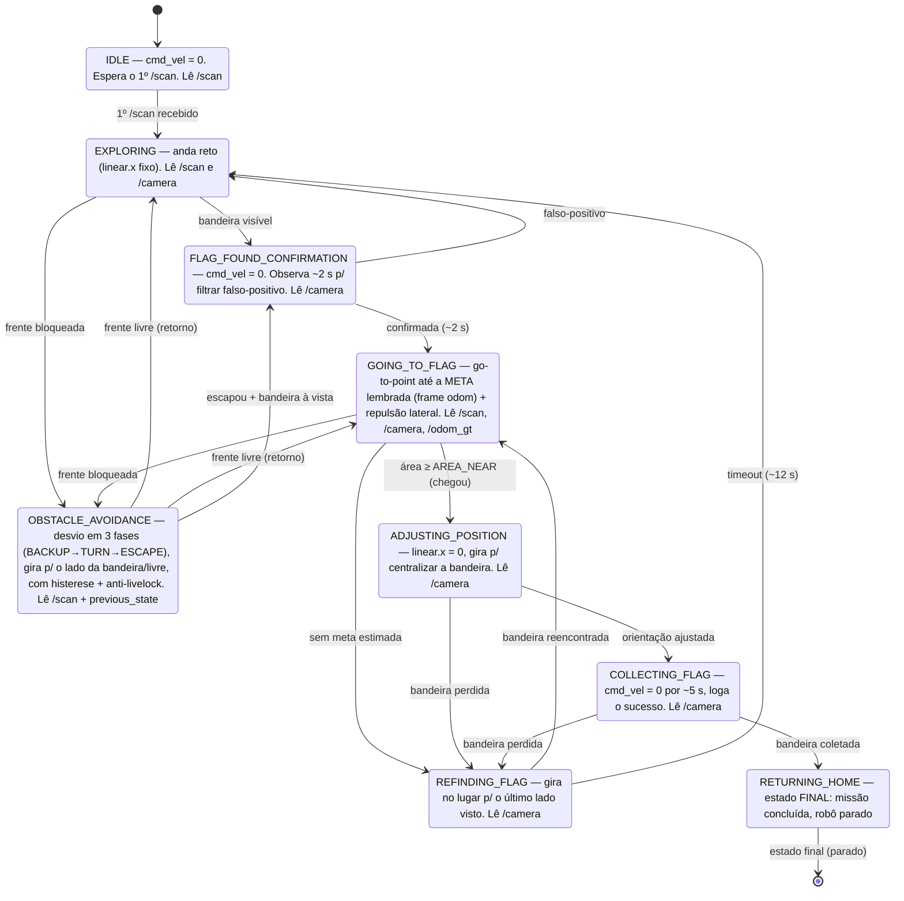

# Máquina de estados da missão (`mission_fsm`)

Diagrama fiel ao código em `src/capture_the_flag/capture_the_flag/mission_fsm.py`.
Tick em duas fases a ~10 Hz: **(1)** avalia a transição do estado atual; **(2)** executa
o comportamento do estado. `OBSTACLE_AVOIDANCE` é um *override* por subsumption: guarda
quem o chamou em `previous_state` e retorna para lá quando a frente libera.

---

## Extensão para o Trabalho 2 — A PROJETAR (tarefa do aluno, critério #1 "expandir a máquina de estados")

O grafo acima é o congelado do T1. O T2 exige *expandir* esta máquina. **Você desenha** — abaixo
só as perguntas de projeto a responder (não a resposta):

1. **Captura real:** o `COLLECTING_FLAG` deixa de ser simbólico e precisa acionar a garra. Isso
   vira **sub-fases dentro de um estado** (como o `OBSTACLE_AVOIDANCE` tem BACKUP→TURN→ESCAPE) ou
   **estados novos** (ex.: `APPROACH_GRASP`→`CLOSING_GRIPPER`→`LIFTING`)? Trade-off? (Uma tentativa
   em 2026-06-28 foi REVERTIDA — reconstruir SOBRE a chegada por área do T1, não no lugar dela.)
2. **Retorno:** `RETURNING_HOME` deixa de ser terminal e vira navegação go-to-point até a
   **pose inicial registrada**. Qual a guarda de "cheguei em casa"? E se a frente bloquear no
   caminho (a subsumption do desvio ainda vale carregando a bandeira)?
3. **Depósito:** estado novo `DEPOSITING_FLAG`. Sequência (posicionar → abrir garra → recuar) —
   estado único com fases ou vários? Guarda de "depositado"? Localiza por odom ou câmera?
4. **Busca dirigida:** o `EXPLORING` vira *traverse* dirigido à zona azul (a bandeira é fixa).
   Muda o grafo ou só o comportamento do estado existente?
5. **Quais arestas novas** aparecem e **quais guardas** as disparam? Desenhe o grafo T2 completo
   aqui quando decidir, do mesmo jeito (com os contratos de comportamento inline).
